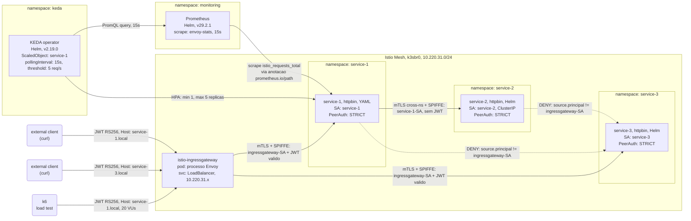
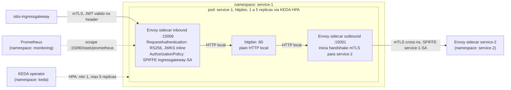
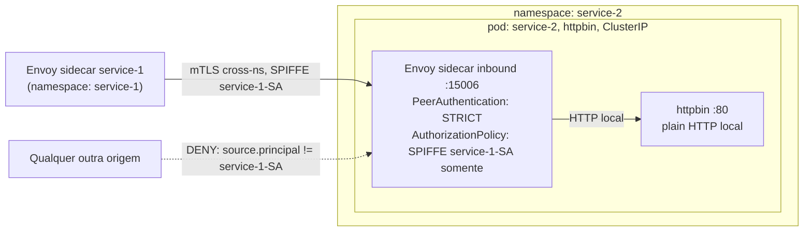
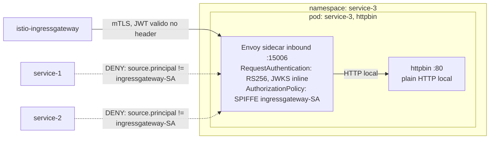

# Desafio Técnico — Pessoa Engenheira DevOps

Cluster k3s multi-nó com Istio service mesh, autenticação JWT, mTLS entre serviços e autoscaling orientado a métricas com KEDA + Prometheus.

---

## Índice

1. [Justificativa da ferramenta de provisionamento](#1-justificativa-da-ferramenta-de-provisionamento)
2. [Arquitetura](#2-arquitetura)
3. [Pré-requisitos](#3-pré-requisitos)
4. [Passo a passo do zero](#4-passo-a-passo-do-zero)
5. [JWT: geração e configuração](#5-jwt-geração-e-configuração)
6. [Comandos de validação](#6-comandos-de-validação)
7. [Justificativa de decisões não triviais](#7-justificativa-de-decisões-não-triviais)
8. [Bônus: Autoscaling com KEDA e Prometheus](#8-bônus-autoscaling-com-keda-e-prometheus)

---

## 1. Justificativa da ferramenta de provisionamento

**Escolha: Incus**

As quatro opções disponíveis foram avaliadas:

| Ferramenta | Eliminado por |
|---|---|
| Vagrant + VirtualBox | O VirtualBox não possui provider nativo para Terraform, apenas uma versão community (`terra-farm/virtualbox`), que fornece apenas o `virtualbox_vm` (sem recursos de rede ou perfil). Por tratar-se de um  hipervisor tipo 2, o VirtualBox também apresenta um overhead maior. Quanto ao Vagrant, ele torna-se redundante visto que será utilizado Terraform no projeto. |
| Vagrant + libvirt | Como afirmado acima, será utilizado Terraform para IaC nativa; tornando o Vagrant dispensável. Quanto ao `libvirt`, a necessidade de inclusão de dependências extras no projeto torna a solução menos prática. |
| Multipass | Sem provider Terraform nativo e  automação limitada para provisionamento de múltiplos nós |
| **Incus** | **Escolhido** |

O Incus foi escolhido pelos seguintes motivos:

**Provider Terraform nativo**: `lxc/incus` v1.0.2 permite declarar VMs, redes e perfis inteiramente em HCL (HashiCorp Configuration Language) — o ciclo `terraform apply` / `terraform destroy` é completamente reproduzível sem intervenção manual.

**VM (KVM) em vez de container (LXC)**: O Istio requer manipulação de `iptables` via `NET_ADMIN` e um init container privilegiado (`istio-init`) que reconfigura as regras de rede antes de cada pod subir. Em containers LXC o kernel é compartilhado com o host — qualquer regra `iptables` injetada pelo Istio afeta a máquina host inteira. Com VMs KVM cada nó tem seu próprio kernel isolado; o `iptables` manipulado pelo Istio fica contido dentro da VM sem impacto externo.

**Coexistência com UFW**: Incus com `ipv4.firewall=false` nas bridges delega toda a gestão de iptables ao UFW do host, evitando conflitos de regras após `terraform destroy + apply` (vide Decisões §7).

---

## 2. Arquitetura

### Nós do cluster

| VM | Papel k3s | IP (DHCP, exemplo) | vCPU | RAM |
|---|---|---|---|---|
| `k3s-server-1` | control-plane | `10.220.31.x` | 2 | 4 GiB |
| `k3s-agent-1` | worker | `10.220.31.x` | 2 | 4 GiB |
| `k3s-agent-2` | worker | `10.220.31.x` | 2 | 4 GiB |

Todos na bridge `k3sbr0` (subnet `10.220.31.0/24`, NAT habilitado via UFW).

A alocação de 2 vCPU e 4 GiB de RAM por VM segue as recomendações oficiais do Istio para ambientes de laboratório, que indicam pelo menos 1 vCPU e 1.5–2 GiB de RAM por pod com sidecar. Como cada node hospeda múltiplos pods (aplicação + sidecar), o cálculo considera 2 pods principais por node, totalizando cerca de 4 GiB de RAM (2 × 2 GiB) e 2 vCPU para evitar contenção e garantir estabilidade do k3s, sidecars, autenticação JWT, mTLS e autoscaling.

### Namespaces e serviços

```
istio-system       — Istio control plane (istiod) + ingress gateway (LoadBalancer)
service-1          — httpbin, acesso externo via JWT, roteia para service-2 via mTLS
service-2          — httpbin, ClusterIP, apenas service-1 pode acessar
service-3          — httpbin, acesso externo via JWT, isolado de outros serviços da malha
monitoring         — Prometheus (bônus)
keda               — KEDA operator (bônus)
```

### Topologia



### Topologia interna por serviço

Os diagramas abaixo detalham os serviços internamente: todo tráfego entra e sai pelo sidecar, que aplica as políticas de segurança (mTLS, SPIFFE, JWT) antes de repassar ao container da aplicação via HTTP local.

#### namespace: service-1



#### namespace: service-2



#### namespace: service-3



## Estrutura do repositório

```
infra/
├── ansible/playbooks/          — Playbooks de bootstrap k3s (server + agents)
├── helm/
│   ├── prometheus/values.yaml  — Config Prometheus com Istio scrape jobs
│   ├── service-2/              — Helm chart para service-2
│   └── service-3/              — Helm chart para service-3
├── jwt/generate.py             — Geração de chave RSA, JWKS e token JWT
├── k8s/
│   ├── namespaces.yaml         — Namespaces com istio-injection: enabled
│   ├── istio/                  — Gateway, PeerAuthentication, VirtualService,
│   │   ├── gateway.yaml          DestinationRule, RequestAuthentication (.tpl),
│   │   ├── service-1/            AuthorizationPolicy por serviço
│   │   ├── service-2/
│   │   └── service-3/
│   ├── keda/
│   │   └── service-1-scaledobject.yaml
│   └── service-1/              — SA, Deployment, Service via kubectl
└── terraform/                  — Definição das VMs, bridge k3sbr0 e perfil Incus
scripts/
├── bootstrap.sh                — Setup completo do zero (idempotente)
├── setup-host.sh               — Configura UFW para bridge Incus
├── load-test.js                — Script k6 para demonstração de autoscaling
└── fresh-install-testing/
    ├── create-vm.sh            — Cria VM Ubuntu 24.04 virgem para teste de reprodutibilidade
    ├── run-test.sh             — Roda dentro da VM: clona repo e executa bootstrap.sh
    └── teardown-vm.sh          — Destrói a VM ao final do teste
```

### Onde o JWT é validado

O JWT é validado pelo **Envoy sidecar de cada serviço** (não no ingressgateway). O fluxo para service-1:

1. `curl` envia `Authorization: Bearer <token>` para o IP do ingressgateway na porta 80.
2. O ingressgateway (que é um proxy Envoy dentro da malha) encaminha o cabeçalho para o sidecar de service-1 via mTLS.
3. O sidecar de service-1 aplica o `RequestAuthentication`: verifica a assinatura RS256 com a JWKS inline. Token inválido → 401 imediato.
4. O sidecar aplica o `AuthorizationPolicy`: exige `request.auth.principal` definido (JWT válido presente) E `source.principals` = SA do ingressgateway. Token ausente → 403.

### Onde o mTLS atua

Todo tráfego pod-a-pod dentro da malha é mTLS obrigatório (`PeerAuthentication: STRICT` nos três namespaces). O modelo:

```
[app container] → plain HTTP → [Envoy sidecar] ═══ mTLS ═══ [Envoy sidecar] → plain HTTP → [app container]
```

O `PeerAuthentication: STRICT` faz o sidecar receptor rejeitar qualquer conexão que não apresente um certificado SPIFFE válido. O `DestinationRule: ISTIO_MUTUAL` instrui o sidecar emissor a sempre usar mTLS ao chamar o destino.

### Como a identidade de serviço é usada nas AuthorizationPolicy

Cada pod roda sob uma `ServiceAccount` explicitamente nomeada. O Istio deriva a identidade SPIFFE da SA:

```
spiffe://cluster.local/ns/<namespace>/sa/<serviceaccount>
```

Esta identidade aparece como `source.principals` nas `AuthorizationPolicy`:

| Política | Permite | Bloqueia |
|---|---|---|
| service-1 | `istio-ingressgateway-service-account` + JWT válido | qualquer outro |
| service-2 | `cluster.local/ns/service-1/sa/service-1` | tudo mais (incluindo ingressgateway) |
| service-3 | `istio-ingressgateway-service-account` + JWT válido | service-1, service-2, qualquer outro |

---

## 3. Pré-requisitos

- Ubuntu 22.04 ou 24.04 LTS (testado em 24.04)
- Conexão com a internet (downloads de pacotes e imagens)
- Usuário não-root com `sudo` sem senha (ou senha disponível no terminal)
- **CPU**: 4+ cores (as 3 VMs k3s alocam 2 vCPU cada — os vCPUs são virtuais e compartilham os cores físicos, mas menos de 4 cores físicos causa contenção)
- **RAM**: 16 GiB mínimo, 20 GiB recomendado (3 VMs × 4 GiB = 12 GiB + overhead do host OS e do Incus)
- **Disco**: ~30 GiB livres (3 VMs × ~8 GiB cada: imagem Ubuntu + k3s + imagens de container do Istio, httpbin, Prometheus, KEDA)

Todas as demais dependências (Incus, Terraform, Ansible, kubectl, Helm, k6, istioctl) são instaladas pelo script `bootstrap.sh`.

---

## 4. Passo a passo de execução do projeto do zero

O projeto pode ser executado do zero de três formas: 
- A) bootstrap automático via script (recomendado para execução no host local limpo),
- B) passo a passo manual seguindo os comandos, 
- C) execução dentro de uma VM Ubuntu virgem criada via Incus aninhado (recomendado para execução isolada numa máquina virtual limpa).

### Opção A — Bootstrap automático (recomendado)

```bash
git clone https://github.com/vitorco7/desafio-devops-prefeitura-rj.git
cd desafio-devops-prefeitura-rj
bash scripts/bootstrap.sh
```

O script executa as seguintes etapas em ordem, com checagens de idempotência em cada uma:

| Etapa | O que faz |
|---|---|
| 0 | Valida OS Ubuntu e execução não-root |
| 1 | Instala Incus, Terraform, Ansible, kubectl, Helm, k6 |
| 2 | Garante membership no grupo `incus` (re-executa se necessário) |
| 3 | Inicializa Incus (`incus admin init --minimal`) |
| 4 | Configura UFW para bridge `k3sbr0` (DHCP, DNS, NAT) via `setup-host.sh` |
| 5 | Provisiona 3 VMs com Terraform |
| 6 | Instala k3s server via Ansible (playbook 01) |
| 7 | Junta agents via Ansible (playbook 02) |
| 8 | Valida cluster (`kubectl get nodes`) |
| 9 | Instala Istio 1.29.2 (`istioctl install --set profile=default`) |
| 10 | Aplica manifests: namespaces, Gateway, PeerAuthentication, VirtualService, DestinationRule, AuthorizationPolicy; gera JWT; aplica RequestAuthentication com JWKS inline; deploy service-1 (kubectl), service-2 (Helm), service-3 (Helm) |
| 11 | Instala Prometheus (Helm, `monitoring`) |
| 12 | Instala KEDA (Helm, `keda`) |
| 13 | Aplica ScaledObject para service-1 |

Tempo esperado em primeira execução: 15–25 minutos (dominado pelo download das imagens Ubuntu e do k3s).

Para destruir o cluster (VMs e rede) sem remover as ferramentas do host:

```bash
bash scripts/bootstrap.sh --destroy
```

### Opção B — Passo a passo manual 

Observação: Nem todos os passos foram validados individualmente, recomendado usar o bootstrap automático para evitar erros de configuração. Os comandos abaixo seguem a mesma ordem do script.

#### 1. Instalar dependências do host

```bash
# Incus (de zabbly/incus-stable)
sudo mkdir -p /etc/apt/keyrings
curl -fsSL https://pkgs.zabbly.com/key.asc \
  | sudo gpg --dearmor -o /etc/apt/keyrings/zabbly.gpg
echo "deb [arch=$(dpkg --print-architecture) signed-by=/etc/apt/keyrings/zabbly.gpg] \
https://pkgs.zabbly.com/incus/stable $(. /etc/os-release && echo $VERSION_CODENAME) main" \
  | sudo tee /etc/apt/sources.list.d/zabbly-incus-stable.list
sudo apt-get update && sudo apt-get install -y incus
sudo usermod -aG incus $USER && newgrp incus

# Terraform (HashiCorp apt)
curl -fsSL https://apt.releases.hashicorp.com/gpg \
  | sudo gpg --dearmor -o /usr/share/keyrings/hashicorp-archive-keyring.gpg
echo "deb [signed-by=/usr/share/keyrings/hashicorp-archive-keyring.gpg] \
https://apt.releases.hashicorp.com $(lsb_release -cs) main" \
  | sudo tee /etc/apt/sources.list.d/hashicorp.list
sudo apt-get update && sudo apt-get install -y terraform

# Ansible
sudo apt-get install -y ansible

# kubectl
curl -fsSL https://pkgs.k8s.io/core:/stable:/v1.33/deb/Release.key \
  | sudo gpg --dearmor -o /etc/apt/keyrings/kubernetes-apt-keyring.gpg
echo "deb [signed-by=/etc/apt/keyrings/kubernetes-apt-keyring.gpg] \
https://pkgs.k8s.io/core:/stable:/v1.33/deb/ /" \
  | sudo tee /etc/apt/sources.list.d/kubernetes.list
sudo apt-get update && sudo apt-get install -y kubectl

# Helm
curl -fsSL https://raw.githubusercontent.com/helm/helm/main/scripts/get-helm-3 | bash

# k6 (Grafana apt)
curl -fsSL https://dl.k6.io/key.gpg \
  | sudo gpg --dearmor -o /etc/apt/keyrings/k6-archive-keyring.gpg
echo "deb [signed-by=/etc/apt/keyrings/k6-archive-keyring.gpg] \
https://dl.k6.io/deb stable main" \
  | sudo tee /etc/apt/sources.list.d/k6.list
sudo apt-get update && sudo apt-get install -y k6
```

#### 2. Configurar grupos, inicializar Incus e UFW

```bash
# Adicionar usuário aos grupos incus e incus-admin
# (necessário para o provider Terraform lxc/incus acessar o projeto 'default' no Incus 6.x)
sudo usermod -aG incus,incus-admin $USER

# Ativar os grupos na sessão atual sem logout/login
newgrp incus-admin

# Apontar socket admin (necessário para o Terraform e para incus admin init)
export INCUS_SOCKET="/var/lib/incus/unix.socket"

# Inicializar Incus (requer sudo antes da primeira init)
sudo incus admin init --minimal

# Configurar CLI para usar o projeto 'default'
# (sem isso, incus exec / terraform não enxergam as VMs criadas)
incus project switch default

# Configurar UFW para bridge k3sbr0 (DHCP, DNS, NAT)
sudo bash scripts/setup-host.sh
```

#### 3. Provisionar VMs

```bash
# INCUS_SOCKET deve estar exportado (ver passo 2)
export INCUS_SOCKET="/var/lib/incus/unix.socket"

terraform -chdir=infra/terraform init -upgrade -input=false
terraform -chdir=infra/terraform apply -auto-approve -input=false
```

#### 4. Instalar k3s

```bash
ansible-playbook infra/ansible/playbooks/01-install-k3s-server.yaml
ansible-playbook infra/ansible/playbooks/02-join-k3s-agents.yaml

# Verificar 3 nós Ready
kubectl get nodes -o wide
```

#### 5. Instalar Istio

```bash
# Instalar istioctl
curl -sL "https://github.com/istio/istio/releases/download/1.29.2/istioctl-1.29.2-linux-amd64.tar.gz" \
  | sudo tar -xz -C /usr/local/bin istioctl

# Instalar Istio no cluster
istioctl install --set profile=default -y
kubectl -n istio-system rollout status deployment/istiod --timeout=120s
kubectl -n istio-system rollout status deployment/istio-ingressgateway --timeout=120s
```

#### 6. Gerar artefatos JWT e aplicar manifests

```bash
# Gerar chave RSA, JWKS e token
python3 infra/jwt/generate.py

# Namespaces com injeção de sidecar
kubectl apply -f infra/k8s/namespaces.yaml

# Istio CRDs (Gateway, PeerAuthentication, VirtualService, DestinationRule, AuthorizationPolicy)
kubectl apply -R -f infra/k8s/istio/

# RequestAuthentication com JWKS inline (via template .tpl)
_apply_jwt() {
  python3 -c "
import json, sys
tpl = open(sys.argv[1]).read()
jwks = json.dumps(json.load(open(sys.argv[2])))
print(tpl.replace('JWKS_INLINE', jwks))
" "$1" infra/jwt/jwks.json | kubectl apply -f -
}
_apply_jwt infra/k8s/istio/service-1/request-authentication.yaml.tpl
_apply_jwt infra/k8s/istio/service-3/request-authentication.yaml.tpl

# service-1 (kubectl)
kubectl apply -R -f infra/k8s/service-1/

# service-2 e service-3 (Helm)
helm install service-2 infra/helm/service-2/ -n service-2
helm install service-3 infra/helm/service-3/ -n service-3

# Aguardar rollout
kubectl rollout status deployment/service-1 -n service-1 --timeout=120s
kubectl rollout status deployment/service-2 -n service-2 --timeout=120s
kubectl rollout status deployment/service-3 -n service-3 --timeout=120s
```

#### 7. Instalar Prometheus e KEDA (bônus)

```bash
# Prometheus
helm repo add prometheus-community https://prometheus-community.github.io/helm-charts
helm repo update prometheus-community
kubectl create namespace monitoring --dry-run=client -o yaml | kubectl apply -f -
helm install prometheus prometheus-community/prometheus \
  --version 29.2.1 -n monitoring \
  -f infra/helm/prometheus/values.yaml \
  --wait --timeout 120s
kubectl rollout status deployment/prometheus-server -n monitoring --timeout=120s

# KEDA
helm repo add kedacore https://kedacore.github.io/charts
helm repo update kedacore
kubectl create namespace keda --dry-run=client -o yaml | kubectl apply -f -
helm install keda kedacore/keda --version 2.19.0 -n keda --wait --timeout 120s
kubectl rollout status deployment/keda-operator -n keda --timeout=120s
kubectl rollout status deployment/keda-operator-metrics-apiserver -n keda --timeout=120s

# ScaledObject
kubectl apply -f infra/k8s/keda/service-1-scaledobject.yaml
```

Para destruir o cluster ao final:

```bash
export INCUS_SOCKET="/var/lib/incus/unix.socket"
terraform -chdir=infra/terraform destroy -auto-approve -input=false
```

### Opção C — Execução em VM virgem via Incus aninhado

Os scripts em `scripts/fresh-install-testing/` criam uma VM Ubuntu 24.04 virgem via KVM aninhado e executam o bootstrap dentro dela. O `create-vm.sh` instala e inicializa o Incus automaticamente se necessário — pode ser executado em uma máquina Ubuntu limpa sem nenhuma dependência prévia.

```bash
# 1. Criar a VM virgem (4 vCPU, 20 GiB RAM, 30 GiB disco)
bash scripts/fresh-install-testing/create-vm.sh

# 2. Entrar na VM como usuário não-root
incus exec fresh-ubuntu -- su -l tester

# 3. Dentro da VM: executar o script de teste
bash run-test.sh

# 4. Ao terminar, destruir a VM (de volta ao host)
bash scripts/fresh-install-testing/teardown-vm.sh
```

O `run-test.sh` clona o repositório do GitHub e executa `bootstrap.sh` exatamente como na Opção A. O comportamento esperado é idêntico ao de uma máquina Ubuntu 24.04 limpa.

> **Nota**: durante o bootstrap, o script executa `exec sg incus-admin "bash $script"` para ativar o grupo `incus-admin` sem necessidade de logout. Isso reinicia o processo do script a partir do início — as etapas já concluídas são puladas pelas checagens de idempotência. É comportamento esperado.

---

## 5. JWT: geração e configuração

Detalhamentos dos critérios utilizados para a escolha  de implementação podem ser encontrados em [Decisões §7](#7-justificativa-de-decisões-não-triviais).

### Por que JWT estático

O desafio especifica token estático pré-gerado sem servidor de identidade. A abordagem usada é:

- **Chave**: RSA-2048, algoritmo RS256
- **Issuer**: `cluster.local`
- **kid**: `k3s-jwt`
- **Expiração**: 2030-01-01 00:00:00 UTC
- **Artefatos**: todos gerados localmente e gitignored (apenas `generate.py` é versionado)

### Gerar os artefatos

```bash
# Requer python3-cryptography (instalado por padrão no Ubuntu 24.04)
python3 infra/jwt/generate.py
```

Saída:

```
Generating RSA-2048 key pair...
  private key → infra/jwt/private.pem
  public key  → infra/jwt/public.pem
  JWKS        → infra/jwt/jwks.json
  token       → infra/jwt/token.jwt

Token expires: 2030-01-01 00:00:00 UTC (unix=1893456000)
Issuer: cluster.local
KID:    k3s-jwt
```

### Como o JWKS é disponibilizado para o Istio

O JWKS **não** é servido via HTTP. O campo `jwks` inline no `RequestAuthentication` contém diretamente o JSON da chave pública:

```yaml
jwtRules:
- issuer: "cluster.local"
  jwks: '{"keys":[{"kty":"RSA","use":"sig","kid":"k3s-jwt","alg":"RS256","n":"...","e":"AQAB"}]}'
```

O `istiod` lê o conteúdo do objeto Kubernetes diretamente — nenhum servidor HTTP é necessário. O `bootstrap.sh` injeta o conteúdo de `jwks.json` no template `.yaml.tpl` via Python antes de fazer `kubectl apply`.

### Verificar o token gerado

```bash
# Decodificar header e payload (sem verificar assinatura)
python3 -c "
import base64, json
token = open('infra/jwt/token.jwt').read().strip()
for part in token.split('.')[:2]:
    pad = part + '=' * (-len(part) % 4)
    print(json.dumps(json.loads(base64.urlsafe_b64decode(pad)), indent=2))
"
```

Saída esperada:

```json
{
  "alg": "RS256",
  "typ": "JWT",
  "kid": "k3s-jwt"
}
{
  "iss": "cluster.local",
  "sub": "test-user",
  "iat": <unix-now>,
  "exp": 1893456000
}
```

---

## 6. Comandos de validação

### Setup inicial (necessário executar uma vez antes dos próximos passos)

```bash
# IP do ingressgateway (muda a cada provisionamento)
GW_IP=$(kubectl get svc istio-ingressgateway -n istio-system \
  -o jsonpath='{.status.loadBalancer.ingress[0].ip}')
echo "GW_IP=$GW_IP"

# Garante que os artefatos JWT existem
# (bootstrap.sh faz isso automaticamente; necessário se executando manualmente)
[ -f infra/jwt/token.jwt ] || python3 infra/jwt/generate.py

# Token JWT
TOKEN=$(cat infra/jwt/token.jwt)
echo "TOKEN=${TOKEN:0:40}..."  # verificar que a variável não está vazia
```

### Requisito 1 — Cluster k3s com 3 nós Ready

*instrucoes-desafio.md §1 — Provisionar 3 nós com a ferramenta escolhida, instalar k3s em cada um (servidor primeiro, agentes via token), todos em estado `Ready`.*

```bash
kubectl get nodes -o wide
# Esperado: k3s-server-1 (control-plane), k3s-agent-1, k3s-agent-2 — todos Ready
```

### Requisito 2 — PeerAuthentication STRICT nos 3 namespaces

*instrucoes-desafio.md §2 — `PeerAuthentication` modo `STRICT` aplicada nos três namespaces da aplicação sem exceções; injeção automática de sidecar habilitada; mTLS obrigatório em toda comunicação pod-a-pod.*

```bash
kubectl get peerauthentication --all-namespaces
# Esperado: service-1/default STRICT, service-2/default STRICT, service-3/default STRICT

# Prova de mTLS: header XFCC aparece na resposta (Envoy injeta após handshake)
curl -s -H "Host: service-1.local" -H "Authorization: Bearer $TOKEN" \
  http://$GW_IP/get \
  | python3 -c "
import sys,json
h=json.load(sys.stdin)['headers']
print(h.get('X-Forwarded-Client-Cert','NOT PRESENT'))
"
# Esperado: By=spiffe://cluster.local/ns/service-1/sa/service-1;...
```

### Requisito 3 — VirtualService e DestinationRule configurados

*instrucoes-desafio.md §2 — `VirtualService` e `DestinationRule` configurados para todo roteamento entre serviços.*

```bash
kubectl get virtualservice,destinationrule --all-namespaces
# Esperado: VS e DR para service-1, service-2, service-3
```

### Requisito 4 — service-1: acesso externo com JWT, routing para service-2 via mTLS

*instrucoes-desafio.md §3 (service-1) — Acessível externamente via JWT; `RequestAuthentication` + `AuthorizationPolicy` para validação; `VirtualService` e `DestinationRule` roteando para service-2; comunicação service-1 → service-2 via mTLS cross-namespace. Três cenários: sem token → 403, token inválido → 401, token válido → 200.*

**Três cenários JWT para service-1:**

```bash
# Sem token → 403
curl -s -o /dev/null -w "sem token (esperado 403): %{http_code}\n" \
  -H "Host: service-1.local" http://$GW_IP/status/200

# Token inválido → 401
curl -s -o /dev/null -w "token inválido (esperado 401): %{http_code}\n" \
  -H "Host: service-1.local" -H "Authorization: Bearer bad.token.here" \
  http://$GW_IP/status/200

# Token válido → 200
curl -s -o /dev/null -w "token válido (esperado 200): %{http_code}\n" \
  -H "Host: service-1.local" -H "Authorization: Bearer $TOKEN" \
  http://$GW_IP/status/200
```

> **Nota sobre 403 vs 401 sem token**: O Istio retorna `401` quando um token é apresentado mas é inválido (rejected pelo `RequestAuthentication`). Quando nenhum token é apresentado, o `RequestAuthentication` deixa a requisição passar sem principal definido e a `AuthorizationPolicy` nega com `403`. Este é o comportamento correto e documentado do Istio — a policy engine usa 403 para "acesso negado", não 401.

**Routing service-1 → service-2 via mTLS:**

```bash
POD1=$(kubectl get pod -n service-1 -l app=service-1 -o jsonpath='{.items[0].metadata.name}')

# service-1 chama service-2 cross-namespace (autenticado pela SA, não JWT)
kubectl exec -n service-1 "$POD1" -c httpbin -- \
  python3 -c "
import urllib.request
r = urllib.request.urlopen('http://service-2.service-2.svc.cluster.local/status/200')
print('service-1 -> service-2:', r.status)
"
# Esperado: 200
```

### Requisito 5 — service-2: ClusterIP, apenas service-1 SA autorizada

*instrucoes-desafio.md §3 (service-2) — `Service` tipo `ClusterIP` (sem exposição externa); `AuthorizationPolicy` permitindo tráfego apenas da service account do service-1 via `source.principals`; demonstrar que tráfego direto sem passar pelo service-1 é bloqueado.*

```bash
# Tentativa externa (sem VirtualService gateway binding) → 404
curl -s -o /dev/null -w "acesso externo svc2 (esperado 404): %{http_code}\n" \
  -H "Host: service-2.local" http://$GW_IP/status/200

# Acesso de service-3 → bloqueado por AuthorizationPolicy → 403
POD3=$(kubectl get pod -n service-3 -l app=service-3 -o jsonpath='{.items[0].metadata.name}')
kubectl exec -n service-3 "$POD3" -c httpbin -- \
  python3 -c "
import urllib.request, urllib.error
try:
    urllib.request.urlopen('http://service-2.service-2.svc.cluster.local/status/200')
    print('INESPERADO: 200')
except urllib.error.HTTPError as e:
    print('service-3 -> service-2 (esperado 403):', e.code)
"
```

### Requisito 6 — service-3: acesso externo com JWT, isolado de outros serviços

*instrucoes-desafio.md §3 (service-3) — Acessível externamente via JWT; `AuthorizationPolicy` negando todo tráfego de outros serviços da malha (service-1 e service-2 não conseguem alcançá-lo). Três cenários: sem token → 403, token inválido → 401, token válido → 200.*

**Três cenários JWT para service-3:**

```bash
# Sem token → 403
curl -s -o /dev/null -w "sem token (esperado 403): %{http_code}\n" \
  -H "Host: service-3.local" http://$GW_IP/status/200

# Token inválido → 401
curl -s -o /dev/null -w "token inválido (esperado 401): %{http_code}\n" \
  -H "Host: service-3.local" -H "Authorization: Bearer bad.token.here" \
  http://$GW_IP/status/200

# Token válido → 200
curl -s -o /dev/null -w "token válido (esperado 200): %{http_code}\n" \
  -H "Host: service-3.local" -H "Authorization: Bearer $TOKEN" \
  http://$GW_IP/status/200
```

**Isolamento de service-3 (outros serviços da malha são bloqueados):**

```bash
# service-1 → service-3: bloqueado (principal = service-1 SA, não ingressgateway)
kubectl exec -n service-1 "$POD1" -c httpbin -- \
  python3 -c "
import urllib.request, urllib.error
try:
    urllib.request.urlopen('http://service-3.service-3.svc.cluster.local/status/200')
    print('INESPERADO: 200')
except urllib.error.HTTPError as e:
    print('service-1 -> service-3 (esperado 403):', e.code)
"

# service-2 → service-3: bloqueado (mesmo motivo)
POD2=$(kubectl get pod -n service-2 -l app=service-2 -o jsonpath='{.items[0].metadata.name}')
kubectl exec -n service-2 "$POD2" -c httpbin -- \
  python3 -c "
import urllib.request, urllib.error
try:
    urllib.request.urlopen('http://service-3.service-3.svc.cluster.local/status/200')
    print('INESPERADO: 200')
except urllib.error.HTTPError as e:
    print('service-2 -> service-3 (esperado 403):', e.code)
"
```

### Checklist completo em um bloco

```bash
GW_IP=$(kubectl get svc istio-ingressgateway -n istio-system \
  -o jsonpath='{.status.loadBalancer.ingress[0].ip}')
TOKEN=$(cat infra/jwt/token.jwt)
POD1=$(kubectl get pod -n service-1 -l app=service-1 -o jsonpath='{.items[0].metadata.name}')
POD3=$(kubectl get pod -n service-3 -l app=service-3 -o jsonpath='{.items[0].metadata.name}')

echo "=== service-1 ==="
curl -s -o /dev/null -w "sem token   (esperado 403): %{http_code}\n" \
  -H "Host: service-1.local" http://$GW_IP/status/200
curl -s -o /dev/null -w "bad token   (esperado 401): %{http_code}\n" \
  -H "Host: service-1.local" -H "Authorization: Bearer bad" http://$GW_IP/status/200
curl -s -o /dev/null -w "valid token (esperado 200): %{http_code}\n" \
  -H "Host: service-1.local" -H "Authorization: Bearer $TOKEN" http://$GW_IP/status/200

echo "=== service-2 (bloqueio direto) ==="
curl -s -o /dev/null -w "acesso externo (esperado 404): %{http_code}\n" \
  -H "Host: service-2.local" http://$GW_IP/status/200

echo "=== service-1 → service-2 (mesh, deve ser 200) ==="
kubectl exec -n service-1 "$POD1" -c httpbin -- \
  python3 -c "import urllib.request; r=urllib.request.urlopen('http://service-2.service-2.svc.cluster.local/status/200'); print(r.status)"

echo "=== service-3 ==="
curl -s -o /dev/null -w "sem token   (esperado 403): %{http_code}\n" \
  -H "Host: service-3.local" http://$GW_IP/status/200
curl -s -o /dev/null -w "valid token (esperado 200): %{http_code}\n" \
  -H "Host: service-3.local" -H "Authorization: Bearer $TOKEN" http://$GW_IP/status/200

echo "=== service-1 → service-3 (bloqueado, esperado 403) ==="
kubectl exec -n service-1 "$POD1" -c httpbin -- \
  python3 -c "
import urllib.request, urllib.error
try:
    urllib.request.urlopen('http://service-3.service-3.svc.cluster.local/status/200')
    print('FAIL: 200')
except urllib.error.HTTPError as e:
    print(e.code)"

echo "=== service-2 → service-3 (bloqueado, esperado 403) ==="
POD2=$(kubectl get pod -n service-2 -l app=service-2 -o jsonpath='{.items[0].metadata.name}')
kubectl exec -n service-2 "$POD2" -c httpbin -- \
  python3 -c "
import urllib.request, urllib.error
try:
    urllib.request.urlopen('http://service-3.service-3.svc.cluster.local/status/200')
    print('FAIL: 200')
except urllib.error.HTTPError as e:
    print(e.code)"
```

---

## 7. Justificativa de decisões de implementação

### Versão do k3s: v1.34.6+k3s1

Versão estável mais recente do canal `stable` no momento da implementação. O k3s bundeia containerd, kubelet, kube-proxy e o API server em um único binário de ~60 MB, tornando a instalação via `curl | sh` determinística sem gerenciamento de múltiplos pacotes.

### CNI: Flannel (padrão do k3s)

O Istio opera sobre o CNI existente — ele não substitui o CNI, ele injeta sidecars que interceptam o tráfego. Flannel é o padrão do k3s, amplamente testado com Istio, e não requer configuração adicional. Substituir por Calico ou Cilium adicionaria complexidade sem benefício para este desafio.

### Escopo do PeerAuthentication: por namespace

O desafio exige STRICT nos três namespaces de aplicação. Uma `PeerAuthentication` mesh-wide (no namespace `istio-system` sem seletor) aplicaria STRICT a _todos_ os namespaces incluindo `kube-system` e `istio-system` — o que quebraria componentes do sistema sem sidecar (CoreDNS, metrics-server). Políticas por namespace aplicam STRICT exatamente onde é necessário, sem efeito colateral nos namespaces de infraestrutura.

### Geração de JWT: `python3-cryptography` vs step / jwt-cli / python-jose

O desafio sugere três ferramentas para gerar tokens offline: `step`, `jwt-cli` e `python-jose`. Todas funcionariam. A escolha por `python3-cryptography` foi motivada por reprodutibilidade sem dependências extras:

| Ferramenta | Dependência adicional | Problema |
|---|---|---|
| `step` | Binário externo (GitHub releases) | Download extra, versão a fixar no bootstrap |
| `jwt-cli` | Binário externo ou `cargo install` | Requer Rust ou download externo |
| `python-jose` | `pip install python-jose` | PEP 668: Ubuntu 24.04 bloqueia `pip install` global sem `--break-system-packages` ou venv |
| **`python3-cryptography`** | Pacote de sistema Ubuntu | **Presente por padrão** no Ubuntu 22.04 e 24.04 |

O `generate.py` não requer `pip install` nem download de binário. O `bootstrap.sh` gera o JWT com zero dependências ocultas além do Python 3 já instalado no sistema.

### Algoritmo JWT: RSA-2048 / RS256

RSA assimétrico foi escolhido porque isola a capacidade de _assinar_ tokens (chave privada, mantida localmente e gitignored) da capacidade de _verificar_ tokens (JWKS público, embutido no manifesto Kubernetes). Qualquer pessoa com acesso ao repositório pode verificar tokens mas não forjá-los. ECDSA (ES256) seria igualmente válido; RSA-2048 foi escolhido por ser o padrão mais comum e bem suportado.

### Imagem: kennethreitz/httpbin

O `httpbin` é a aplicação de referência usada em toda a documentação oficial do Istio. O endpoint `/headers` retorna todos os cabeçalhos recebidos pelo pod — incluindo o `X-Forwarded-Client-Cert` injetado pelo Envoy após o handshake mTLS — tornando a validação do mTLS trivial sem código customizado. O foco do desafio é a configuração do Istio, não a aplicação em si.

### JWKS inline vs jwksUri

O campo `jwks` inline no `RequestAuthentication` elimina a necessidade de servir a chave pública via HTTP. O `istiod` lê o conteúdo diretamente do objeto Kubernetes — zero infraestrutura extra, zero latência de fetch, zero ponto de falha externo. Uma alternativa via `jwksUri` exigiria um servidor HTTP em cluster (ConfigMap + nginx + Service) que seria removido na primeira reprovisão.

### Istio 1.29.2 e native sidecars

O Istio 1.29 introduziu suporte a Kubernetes native sidecars (`initContainer` com `restartPolicy: Always`). Isso mudou como o Prometheus descobre os proxies Envoy: `role: pod` não itera `initContainers` para labels de porta. A config de scrape do `envoy-stats` foi adaptada para filtrar por anotação `prometheus.io/path=/stats/prometheus` (que o Istio injeta em todos os pods) em vez de filtrar por nome de porta de container.

### `ipv4.firewall=false` na bridge Incus

Quando o UFW está ativo e o Incus cria uma nova bridge, ambos tentam gerenciar `iptables`. Após `terraform destroy + apply`, as regras se tornam conflitantes. Com `ipv4.firewall=false`, o Incus delega toda a gestão de iptables ao UFW (configurado pelo `setup-host.sh`). Como as regras UFW são keyed pelo nome da interface (`k3sbr0`), elas se aplicam automaticamente a qualquer bridge com esse nome, independente de quantas vezes o Terraform recrie o recurso.

### Token via stdin no Ansible (no_log: true)

O token de join do k3s é passado via variável de ambiente `--env K3S_TOKEN=` no `incus exec` com `no_log: true`. Isso evita que o valor apareça em argv do processo (visível em `ps aux`) e nos logs do Ansible. Em produção, um secrets manager seria usado — aqui, `no_log` é o equilíbrio pragmático para um lab local.

---

## 8. Bônus: Autoscaling com KEDA e Prometheus

### Visão geral do pipeline

```
k6 → ingressgateway → service-1 → Envoy emite istio_requests_total
                                          │
                               Prometheus scrape (15s)
                                          │
                              KEDA consulta Prometheus
                                          │
                               HPA ajusta réplicas
```

### Parâmetros do pipeline: critérios de escolha

Cada parâmetro numérico no pipeline de autoscaling tem uma dependência com o próximo. A cadeia completa é:

```
scrape_interval (Prometheus)
  → tamanho efetivo da janela rate()   (PromQL)
    → tempo de reação do KEDA          (pollingInterval)
      → tempo mínimo de scale-down     (cooldownPeriod + stabilizationWindowSeconds)
```

#### `scrape_interval: 15s` no job `envoy-stats`

O intervalo global do Prometheus neste projeto é `60s` (padrão). A função `rate(v[d])` requer **no mínimo 2 amostras** dentro da janela `d` para produzir um resultado não-nulo — com 1 sample por minuto, uma janela `[1m]` conteria apenas 1 amostra (insuficiente) por até 2 minutos após o início do tráfego.

Com `scrape_interval: 15s` aplicado especificamente ao job `envoy-stats`:

| Janela rate() | Amostras disponíveis | Primeiro resultado válido |
|---|---|---|
| `[1m]` com scrape 60s | 1 | após ~2 min |
| `[1m]` com scrape 15s | 4 | após ~30s |

O override de intervalo foi aplicado **apenas ao job `envoy-stats`** — não globalmente — para não aumentar o custo de ingestão dos outros jobs (istiod, kubernetes-pods, etc.) que não alimentam o autoscaling.

#### Janela `rate([1m])`

Uma janela mais curta (`[30s]`) produziria uma métrica mais reativa mas com mais ruído — um burst pontual de 2s inflaria a taxa aparente por toda a janela. Uma janela mais longa (`[5m]`) suavizaria demais e atrasaria o scale-up. `[1m]` é o equilíbrio padrão da documentação do Istio para métricas de taxa de requisição, e com `scrape_interval: 15s` a janela de 1 minuto contém 4 amostras — suficiente para uma estimativa confiável sem suavização excessiva.

#### `pollingInterval: 15s` no ScaledObject

O KEDA consulta o Prometheus a cada `pollingInterval`. Definir este valor abaixo do `scrape_interval` seria inútil — o KEDA leria o mesmo valor repetidamente entre scrapes. Sincronizando ambos em 15s, cada consulta do KEDA lê dados frescos:

```
t=0s   Prometheus scrape  → KEDA poll  → HPA recalcula
t=15s  Prometheus scrape  → KEDA poll  → HPA recalcula
t=30s  Prometheus scrape  → KEDA poll  → HPA recalcula
```

#### `threshold: 5` req/s por réplica

O threshold define quantas requisições por segundo cada réplica deve absorver antes do HPA adicionar outra. O critério foi:

- Carga do k6: 20 VUs × 2 req/s (sleep 0.5s) = **~40 req/s sustentado**
- Com threshold=5: `ceil(40/5) = 8` réplicas necessárias → clamped para `maxReplicaCount=5`
- Resultado desejado: escalar até o máximo durante o teste, demonstrando o limite

Threshold menor (ex: 2) escalaria mais rápido mas atingiria o máximo com menos carga, tornando o demo menos ilustrativo. Threshold maior (ex: 20) não escalaria o suficiente para mostrar múltiplos steps.

#### `cooldownPeriod: 60s` e `stabilizationWindowSeconds: 60s`

Estes dois parâmetros controlam o scale-down, mas atuam em camadas diferentes:

| Parâmetro | Controlado por | Efeito |
|---|---|---|
| `cooldownPeriod: 60` | KEDA | Mínimo de 60s após a métrica cair abaixo do threshold antes de KEDA sinalizar "scale down" ao HPA |
| `stabilizationWindowSeconds: 60` | HPA (via `advanced.horizontalPodAutoscalerConfig`) | HPA espera que a métrica permaneça abaixo do threshold por 60s antes de executar o scale-down |

Sem o override de `stabilizationWindowSeconds`, o HPA usaria seu padrão de **300s** — o scale-down após o k6 terminar levaria 5 minutos, tornando a demonstração tediosa. Com 60s em ambos, o scale-down acontece em ~2 minutos após o fim da carga, que é observável numa demo ao vivo.

Os dois parâmetros são redundantes em parte, mas complementares: `cooldownPeriod` é uma proteção do KEDA contra oscilações rápidas da métrica; `stabilizationWindowSeconds` é a proteção do HPA contra flapping no nível do Kubernetes.

### Métrica escolhida

```promql
sum(rate(istio_requests_total{
  job="envoy-stats",
  destination_workload="service-1",
  destination_workload_namespace="service-1",
  response_code!~"5.."}[1m]))
```

`istio_requests_total` é um contador incremental emitido pelo sidecar Envoy de cada pod. `rate([1m])` calcula a taxa média por segundo na janela de 1 minuto. O filtro `response_code!~"5.."` exclui erros 5xx — evita scale-up espúrio causado por tempestades de erro.

**Por que `scrape_interval: 15s` no job `envoy-stats`?** O intervalo global padrão do Prometheus é 1 minuto. Com apenas 1 sample por minuto, `rate([1m])` precisa de pelo menos 2 amostras para produzir resultado não-nulo — o que exigiria esperar 2 minutos antes da primeira leitura. Com 15s de intervalo, há 4 amostras por janela de 1 minuto, garantindo que KEDA veja a métrica em menos de 30 segundos após o início do tráfego.

### Configuração do ScaledObject

| Parâmetro | Valor | Motivo |
|---|---|---|
| `threshold` | `5` req/s por réplica | 20 VUs × 2 req/s = 40 req/s → ceil(40/5) = 8 → clamped para max=5 |
| `minReplicaCount` | `1` | service-1 deve estar sempre disponível |
| `maxReplicaCount` | `5` | Limite para não esgotar recursos das VMs de 4 GiB |
| `pollingInterval` | `15` s | Sincronizado com o scrape_interval do Prometheus |
| `cooldownPeriod` | `60` s | KEDA espera 60s após métrica cair antes de desativar o trigger |
| `scaleDown.stabilizationWindowSeconds` | `60` s | Sobrescreve o padrão HPA de 300s para permitir scale-down observável em demo |

### Demonstração do scale-up e scale-down

**Pré-requisito**: cluster com service-1 running, Prometheus e KEDA instalados.

```bash
# Terminal A — observar pods
kubectl get pods -n service-1 -w

# Terminal B — observar HPA
kubectl get hpa -n service-1 -w

# Terminal C — executar k6
cd ~/desafio-devops-prefeitura-rj   # necessário para paths relativos (infra/jwt/, scripts/)
GW_IP=$(kubectl get svc istio-ingressgateway -n istio-system \
  -o jsonpath='{.status.loadBalancer.ingress[0].ip}')
TOKEN=$(cat infra/jwt/token.jwt)
k6 run -e TOKEN=$TOKEN -e GW_IP=$GW_IP scripts/load-test.js
```

O script k6 (`scripts/load-test.js`) usa 20 VUs com `sleep(0.5)` entre requisições → ~40 req/s. Cada requisição inclui `Host: service-1.local` e `Authorization: Bearer $TOKEN`.

**Progressão observada (saída real):**

```
# HPA (Terminal B)
NAME                              TARGETS         REPLICAS
keda-hpa-service-1-scaledobject   0/5 (avg)       1        ← idle
keda-hpa-service-1-scaledobject   6733m/5 (avg)   1        ← k6 iniciou
keda-hpa-service-1-scaledobject   16111m/5 (avg)  2        ← scale 1→2
keda-hpa-service-1-scaledobject   12139m/5 (avg)  4        ← scale 2→4
keda-hpa-service-1-scaledobject   12338m/5 (avg)  5        ← scale 4→5 (max)
keda-hpa-service-1-scaledobject   7810m/5 (avg)   5        ← estável em 5
```

O valor `6733m` significa 6,733 req/s por réplica (milli req/s). Com 1 réplica, isso excede o threshold de 5 → HPA escala.

**Scale-down** (~2 minutos após k6 terminar):

```bash
kubectl describe hpa keda-hpa-service-1-scaledobject -n service-1 | grep -A5 "Events:"
# Eventos esperados:
#   SuccessfulRescale: New size: 2; reason: external metric above target
#   SuccessfulRescale: New size: 4; reason: external metric above target
#   SuccessfulRescale: New size: 5; reason: external metric above target
#   SuccessfulRescale: New size: 1; reason: All metrics below target   ← scale-down
```

### Saída do k6 (run completo)

```
checks_total.......: 6909    100% (6909/6909)
✓ status is 200
✓ no 401 (JWT rejected)
✓ no 403 (authz denied)
http_reqs..............: 2303   38.1/s
```

Todos os checks passaram: JWT válido, AuthorizationPolicy correta, mTLS transparente.

---

