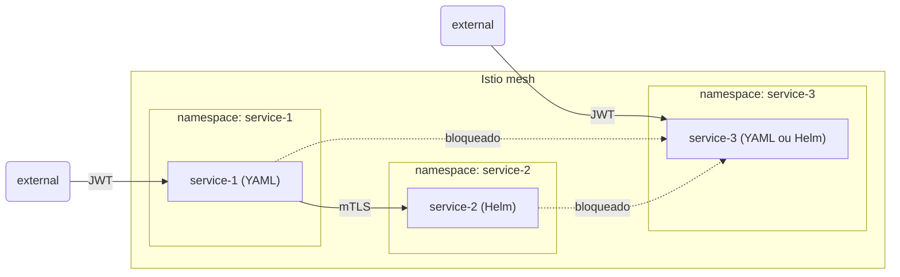

# Desafio Técnico — Pessoa Engenheira DevOps

## Contexto

Este desafio avalia sua capacidade de provisionar infraestrutura Kubernetes do zero e de operar um service mesh com comunicação segura entre serviços e autenticação baseada em JWT. O foco é a infraestrutura: como você provisiona os nós, configura o cluster, gerencia identidade de serviço e documenta suas decisões.

## Objetivo

Provisionar um cluster **k3s multi-nó** (1 servidor + 2 agentes) usando containers ou VMs locais, instalar o Istio como service mesh e implantar três serviços com políticas de segurança distintas.

## Ferramentas permitidas para provisionamento

Escolha **uma** das opções abaixo e justifique sua escolha na documentação:

| Ferramenta                                                                        | Backend               |
| --------------------------------------------------------------------------------- | --------------------- |
| [Incus](https://linuxcontainers.org/incus/)                                       | LXC/KVM               |
| [Multipass](https://multipass.run/)                                               | HyperKit/QEMU/Hyper-V |
| [Vagrant](https://www.vagrantup.com/) + [VirtualBox](https://www.virtualbox.org/) | VirtualBox            |
| [Vagrant](https://www.vagrantup.com/) + [libvirt](https://libvirt.org/)           | KVM/QEMU              |

O gerenciamento de rede entre os nós deve ser feito pela própria ferramenta escolhida. Não é necessário configurar IPs estáticos, `/etc/hosts` ou regras de firewall manualmente.

> **Ferramentas não permitidas:** `minikube` e `kind` não são aceitos — ambos são single-node by design e não refletem um ambiente multi-nó real.

## Requisitos

### 1. Cluster k3s

- Provisionar **3 nós** com a ferramenta escolhida: 1 servidor (control plane) e 2 agentes
- Instalar e configurar o **k3s** em cada nó: servidor inicializado primeiro, agentes ingressados via token do servidor
- O cluster deve estar com os 3 nós em estado `Ready` (`kubectl get nodes`)

### 2. Service mesh

Instalar **Istio** no cluster com os seguintes requisitos globais:

- `PeerAuthentication` em modo `STRICT` aplicada nos três namespaces da aplicação — sem exceções por porta ou workload
- Injeção automática de sidecar habilitada nos três namespaces
- `VirtualService` e `DestinationRule` configurados para todo roteamento entre serviços

### 3. Serviços

Implantar **três serviços**, cada um em seu próprio namespace, todos com acesso externo protegido por JWT e comunicação interna protegida por mTLS.

A escolha da aplicação HTTP de cada serviço é livre — pode ser `httpbin`, um servidor de echo, ou qualquer imagem simples que responda a requisições HTTP. O foco é a configuração do Istio, não a aplicação em si.

#### Topologia



#### service-1 (namespace `service-1`) — manifesto kubectl (YAML)

- Acessível externamente via `LoadBalancer`
- `RequestAuthentication` + `AuthorizationPolicy` para validação de JWT
- `VirtualService` e `DestinationRule` para roteamento ao `service-2`
- Comunicação com `service-2` via mTLS cross-namespace

#### service-2 (namespace `service-2`) — Helm

- `Service` do tipo `ClusterIP` (sem exposição externa)
- `AuthorizationPolicy` permitindo tráfego **apenas** da service account do `service-1`, via `source.principals` no formato `cluster.local/ns/service-1/sa/<sa>`
- Demonstrar que tráfego direto ao `service-2` sem passar pelo `service-1` é bloqueado

#### service-3 (namespace `service-3`) — manifesto kubectl (YAML) ou Helm

- Acessível externamente via `LoadBalancer`
- `RequestAuthentication` + `AuthorizationPolicy` para validação de JWT
- `AuthorizationPolicy` negando **todo tráfego** de outros serviços da malha (`service-1` e `service-2` não conseguem alcançá-lo)
- Demonstrar que tentativas de acesso de `service-1` ou `service-2` ao `service-3` são bloqueadas

### 4. Configuração do JWT

- Token **estático pré-gerado** com chave RSA ou ECDSA (nenhum servidor de identidade é necessário)
- O JWKS público deve ser disponibilizado para o Istio validar as assinaturas
- JWT aplicado via `RequestAuthentication` nos namespaces `service-1` e `service-3`
- Demonstrar os três cenários em cada serviço exposto externamente: sem token (`401`), token inválido (`401`) e token válido (`200`)

### 5. Bônus — Autoscaling com KEDA e Prometheus

> Esta seção é opcional. Sua implementação será considerada positivamente na avaliação, mas não é exigida.

Configurar autoscaling orientado a métricas do Istio para um ou mais serviços usando **KEDA** + **Prometheus**.

- Instalar o **Prometheus** no cluster (via Helm ou manifesto) configurado para coletar métricas do Istio
- Instalar o **KEDA** no cluster
- Criar um `ScaledObject` para pelo menos um dos serviços, escalando com base em uma métrica exposta pelo Istio via Prometheus (ex: taxa de requisições `istio_requests_total`, conexões ativas, ou latência `istio_request_duration_milliseconds`)
- Demonstrar o autoscaling em ação usando [**k6**](https://k6.io/) para gerar carga no serviço — mostrar novos pods sendo criados durante a carga e o scale-down após sua remoção

### 6. Documentação

Incluir um arquivo `README.md` com:

- **Justificativa da ferramenta de provisionamento escolhida**
- **Arquitetura**: diagrama ou descrição dos nós, namespaces, serviços, fluxo de tráfego e políticas aplicadas — indicando onde o JWT é validado, onde o mTLS atua e como a identidade de serviço é usada nas `AuthorizationPolicy`
- **Como gerar o token JWT** e como o JWKS foi configurado
- **Passo a passo reproduzível** do zero (assumindo máquina limpa)
- **Comandos de validação** para cada requisito: cenários de JWT, bloqueio de acesso direto ao `service-2`, e isolamento do `service-3`
- **Justificativa de decisões não triviais** (versão do k3s, CNI, escopo do `PeerAuthentication`, algoritmo JWT, imagens escolhidas, etc.)
- **(Bônus)** Descrição da métrica escolhida para o autoscaling, script k6 utilizado e demonstração do scale-up/down

## Critérios de avaliação

| Critério                                                                                        | Peso  |
| ----------------------------------------------------------------------------------------------- | ----- |
| Cluster funcional com os 3 nós em estado `Ready`                                                | Alto  |
| `PeerAuthentication` em modo `STRICT` nos três namespaces                                       | Alto  |
| `VirtualService` e `DestinationRule` configurados corretamente                                  | Alto  |
| `service-1` acessível externamente com JWT e roteando para `service-2` via mTLS                 | Alto  |
| `service-2` acessível apenas pelo `service-1` via `AuthorizationPolicy` com `source.principals` | Alto  |
| `service-3` acessível externamente com JWT e isolado de outros serviços da malha                | Alto  |
| Três cenários de JWT demonstrados para cada serviço externo                                     | Alto  |
| Reprodutibilidade: conseguimos replicar do zero seguindo o README                               | Alto  |
| Qualidade e clareza da documentação (arquitetura, namespaces, políticas de identidade)          | Alto  |
| Justificativa das escolhas técnicas                                                             | Médio |
| Organização do repositório                                                                      | Médio |

## O que **não** será avaliado

- Uso de serviços cloud (AWS, GCP, Azure, etc.)
- Alta disponibilidade do control plane
- Servidor de identidade/SSO (Keycloak, Dex, etc.)
- Performance ou otimização de recursos

## Entrega

Repositório Git (público ou com acesso compartilhado) contendo:

- Arquivos de provisionamento (`Vagrantfile`, perfil/script Incus, playbook Ansible, etc.)
- Scripts ou código IaC de bootstrap, se utilizados
- Manifestos YAML e/ou `values.yaml` Helm dos serviços e políticas do Istio
- JWKS público e instruções de geração do token
- **(Bônus)** Script k6 para geração de carga
- `README.md` com toda a documentação exigida

Não é necessário gravar vídeo ou fazer apresentação.

## Dicas

- Prefira provisionamento reproduzível com scripts ou ferramentas de IaC (Ansible, Terraform, etc.). Se fizer algo manualmente, documente.
- O Istio em modo sidecar injeta um proxy Envoy em cada pod, o que gera overhead de memória relevante em nós pequenos — considere isso ao dimensionar as VMs/containers.
- Ferramentas como [`step`](https://smallstep.com/docs/step-cli/), [`jwt-cli`](https://github.com/mike-engel/jwt-cli) ou `python-jose` facilitam a geração de tokens JWT offline.
- Para validar o mTLS, tente fazer `curl` de um pod sem sidecar diretamente ao `ClusterIP` do `service-2` — deve ser recusado.
- Cada serviço deve ter uma `ServiceAccount` explicitamente nomeada — sem ela o pod usa `default`, tornando o `source.principals` na `AuthorizationPolicy` não único e inutilizável. O formato do principal cross-namespace é `cluster.local/ns/<namespace>/sa/<service-account>`.
- **(Bônus)** O k6 suporta envio do header `Authorization` via `params.headers` — necessário para passar pelo JWT ao gerar carga nos serviços.
- **(Bônus)** Para coletar métricas do Istio no Prometheus, configure dois scrape jobs no `extraScrapeConfigs` do chart `prometheus-community/prometheus`:

  ```yaml
  extraScrapeConfigs: |
    - job_name: istiod
      kubernetes_sd_configs:
        - role: endpoints
          namespaces:
            names: [istio-system]
      relabel_configs:
        - source_labels: [__meta_kubernetes_service_name, __meta_kubernetes_endpoint_port_name]
          action: keep
          regex: "istiod;http-monitoring"

    - job_name: envoy-stats
      metrics_path: /stats/prometheus
      kubernetes_sd_configs:
        - role: pod
      relabel_configs:
        - source_labels: [__meta_kubernetes_pod_container_port_name]
          action: keep
          regex: ".*-envoy-prom"
        - source_labels: [__address__, __meta_kubernetes_pod_annotation_prometheus_io_port]
          action: replace
          regex: '([^:]+)(?::\d+)?;(\d+)'
          replacement: "$1:15090"
          target_label: __address__
        - action: labelmap
          regex: __meta_kubernetes_pod_label_(.+)
        - source_labels: [__meta_kubernetes_namespace]
          target_label: namespace
        - source_labels: [__meta_kubernetes_pod_name]
          target_label: pod_name
  ```

- Destrua o ambiente e recrie do zero antes de entregar — isso confirma a reprodutibilidade.
- A qualidade da documentação tem o mesmo peso que o cluster funcionando.
